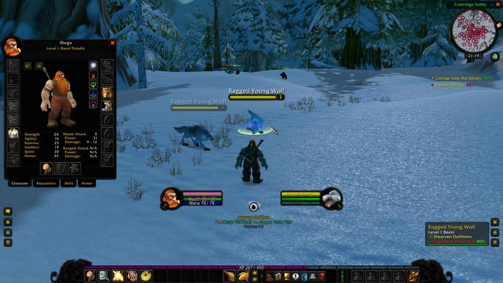

# staticmod

A small unfinished addon that slightly adjusts the wow stock UI to my personal needs.
See config.lua for the limited options available. Don't ask for features, I don't plan to maintain this at all.

## General
- `/rl` can be used to reload the UI
- `print()` can be used to output messages
- `print()` and `message()` cache their output to only display the same message once each session.

## Unitframes
- Player unitframe has the same background texture as target frame
- Optional: Class colors can be used instead of reaction colors
- Optional: Color backgrounds can be hidden for friendly NPCs

## Minimap
- Minimap can be zoomed via mousewheel
- Minimap day/night icon and zoom buttons removed
- A clock now shows up on the minimap
- Optional: A squared minimap

## Chat
- A second chat window is created (Loot & Spam)
- Chat messages are split into left and right chat.
  * Left Chat is used for important messages
    *(Say, Party, Guild, Whisper)*
  * Right Chat is used for Loot & Spam
    *(NPC messages, Global Channels, Loot, Skill)*
- The chat cursor can be moved without pressing <Alt>
- Chat can be scrolled via mousewheel (hold shift to jump up/down)

## Worldmap
- Worldmap gets opened window mode
- Window can be scaled with Mousewheel+Ctrl
- Window can be made transparent with Mousewheel+Shift
- On the bottom-left of the worldmap, the coordinates are displayed

## Darken
- Optional: All frames can be scanned to modify the textures to a darker version

## Nameplates
- Nameplates scale with UI-Scale (Vanilla only)

## Sell Value
- Shows vendor sell values on item tooltips

## Equip Compare
- Shows a tooltip of the equipped item while <Shift> key is pressed

## Auto-Sell
- Each Merchant has a button to sell all grey items

## Layout
- Player and target are moved to the bottom-center of the screen
- Both chat frames are aligned to bottom left and bottom right
